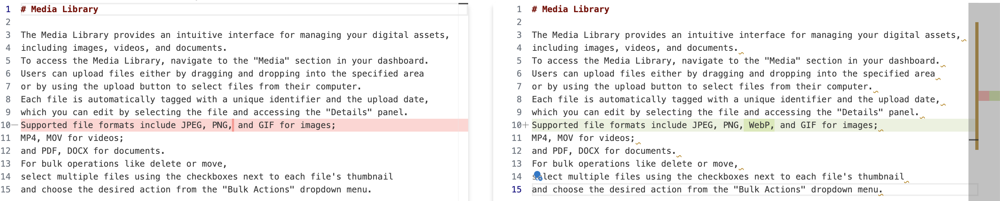

# About

`vscode-sembr` is a work-in-progress VSCode linter extension which will support the
[Semantic Line Breaks specification](https://sembr.org).

## Features

The extension will add commands to the Command Palette
to format a supported document with semantic line breaks.

## Extension Settings

Coming soon!

## Known Issues

This is a work-in-progress extension and is **not currently functional.**

## Help Build It

Seeking contributors!
If you'd like to make this extension a reality, get in touch!